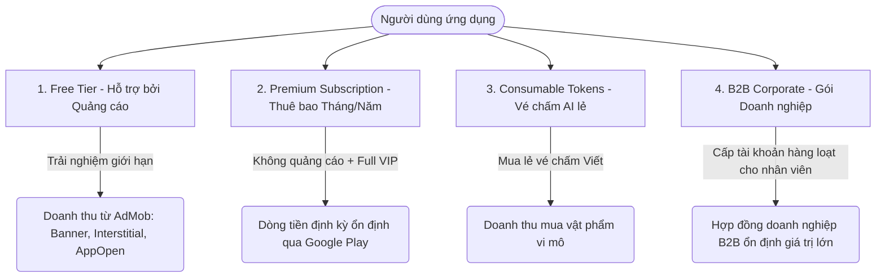

# 🇰🇷 BẢN ĐỒ PHÁT TRIỂN & CHIẾN LƯỢC TỐI ƯU HÓA DOANH THU (ROADMAP & MONETIZATION STRATEGY)
*Tài liệu hướng dẫn rà soát hệ thống, cải tiến tính năng học tập và tạo dòng tiền ổn định.*

---

## I. ĐÁNH GIÁ HỆ THỐNG HIỆN TẠI (CURRENT SYSTEM REVIEW)

Hệ thống sở hữu một nền tảng kỹ thuật rất vững chắc và có tính tổ chức cao (Decoupled Turborepo Monorepo). Dưới đây là phân tích chi tiết:

### 1. Điểm Mạnh Kiến Trúc & Công Nghệ
*   **Frontend (Flutter 3.x + Riverpod + GoRouter):** Quản lý trạng thái bằng Riverpod rất sạch sẽ, hỗ trợ điều hướng mượt mà, lưu trữ cục bộ tối ưu bằng Hive để học offline nhẹ nhàng. Đã tích hợp sẵn **Google Mobile Ads** (Banner, Interstitial, AppOpen) và cổng thanh toán **Google Play In-App Purchase** cực kỳ chuyên nghiệp.
*   **Backend (NestJS + Prisma + PostgreSQL):** Sử dụng các Best Practices về phân quyền (RBAC), bảo mật chặt chẽ. Cơ chế **Redis + BullMQ** hỗ trợ xử lý hàng đợi bất đồng bộ tốt, tránh tắc nghẽn khi có nhiều yêu cầu chấm thi AI cùng lúc.
*   **Trí tuệ nhân tạo (AI-Driven):** Chức năng chấm bài viết TOPIK (AI Writing Evaluator) kết nối qua OpenRouter/Gemini là một tính năng đột phá, giải quyết trực tiếp nỗi sợ lớn nhất của học viên thi TOPIK II.
*   **Admin Panel (React + Tailwind):** Hệ thống Bulk Import dữ liệu qua file JSON giúp việc biên soạn và nạp bài học/đề thi TOPIK cực kỳ nhanh chóng.

### 2. Các Điểm Cần Cải Thiện & Cơ Hội Bứt Phá
*   **Học tiếng Hàn chuyên ngành:** Hiện tại, từ vựng đang bị ràng buộc cố định trong các bài học (`Lesson`). Cần tách biệt module **"Từ điển/Sổ tay từ vựng chuyên ngành"** tương tác động để học viên là người đi làm có thể tra cứu và học nhanh theo các lĩnh vực (IT, Sản xuất, Văn phòng, Xây dựng).
*   **TOPIK II Writing Scaffold:** Phần Viết thi thử (Câu 51-54) mới dừng lại ở việc chấm điểm & feedback chung. Học viên cần được định hướng bằng **khung sườn (templates/formulas)**, đặc biệt là biểu đồ Câu 53 và nghị luận Câu 54 để viết đúng cấu trúc chuẩn trước khi gửi AI chấm.
*   **Trải nghiệm Cá nhân hóa (AI Diagnostics):** Người dùng học xong hoặc thi thử xong thường không biết mình yếu ở điểm nào. Hệ thống cần tự động phân tích và tạo ra **"Đơn thuốc ôn tập" (Remediation Plan)** chứa các link bài học ngữ pháp bị hổng.
*   **Mức độ Tương tác UI/UX:** Cần thêm các phản hồi xúc giác (Haptic Feedback) và hiệu ứng chuyển cảnh cao cấp (Glassmorphic Dark Mode, Custom Lottie Animations) để tạo sự phấn khích và cao cấp khi học viên tương tác.

---

## II. CHIẾN LƯỢC KIẾM TIỀN & TẠO DÒNG TIỀN (MONETIZATION & CASHFLOW STRATEGY)

Để tạo dòng tiền ổn định, bền vững mà vẫn giữ chân được người dùng, chúng tôi đề xuất áp dụng **Mô hình Hybrid (Freemium + Premium + Consumables + B2B)**:



### 1. Phân Cấp Tính Năng (Freemium Breakdown)

| Tính năng | Tài khoản Miễn phí (Free) | Tài khoản Cao cấp (Premium - VIP) |
| :--- | :--- | :--- |
| **Quảng cáo** | Có quảng cáo (Banner, Interstitial, AppOpen) | **Hoàn toàn không có quảng cáo (Ad-Free)** |
| **Bài học cơ bản** | Truy cập đầy đủ | Truy cập đầy đủ |
| **Từ vựng Chuyên ngành** | Cho học thử 1 chuyên ngành (ví dụ: Công sở) | **Mở khóa toàn bộ chuyên ngành (IT, EPS, Xây dựng, Y tế...)** |
| **Chấm điểm Viết AI** | Giới hạn 2 lần chấm/ngày | **Không giới hạn lượt chấm bài viết** |
| **Giải thích đề thi TOPIK** | Chỉ xem đáp án Đúng/Sai | **Xem giải thích chi tiết ngữ pháp & từ vựng từ AI** |
| **Học offline & TTS** | Chỉ dùng online | **Tải bài học & file âm thanh học offline mọi nơi** |

### 2. Mô hình Mua lẻ Vật phẩm Vi mô (Consumables - AI Tickets)
*   Nhiều học viên chỉ cần ôn thi gấp trong 1-2 tuần cuối và không muốn đăng ký gói định kỳ hàng tháng.
*   **Giải pháp:** Bán các gói **"Vé chấm điểm AI" (AI Writing Tickets)**:
    *   *Gói Khởi động:* 10 lượt chấm AI = 49.000 đ
    *   *Gói Tăng tốc:* 30 lượt chấm AI = 99.000 đ
    *   *Gói Về đích:* 100 lượt chấm AI = 249.000 đ
*   **Ưu điểm:** Tỉ lệ chuyển đổi cực cao đối với đối tượng học viên có tâm lý e ngại gói subscription tự động gia hạn.

### 3. Gói Doanh nghiệp B2B (Corporate Bulk Licensing)
*   Thị trường Việt Nam có hàng ngàn doanh nghiệp Hàn Quốc (Samsung, LG, các vendor cấp 1-2) và các công ty phái cử lao động EPS. Họ có nhu cầu đào tạo tiếng Hàn cho kỹ sư, công nhân viên rất lớn.
*   **Giải pháp:** Bán tài khoản premium số lượng lớn với bảng điều khiển Admin thu gọn dành riêng cho HR/Lãnh đạo doanh nghiệp để:
    *   Theo dõi thời lượng tự học của nhân viên.
    *   Kiểm tra điểm số TOPIK / Từ vựng chuyên ngành của từng cá nhân.
    *   Xuất báo cáo định kỳ để đánh giá KPI năng lực.

---

## III. LỘ TRÌNH PHÁT TRIỂN & CẢI TIẾN TÍNH NĂNG (FEATURE ROADMAP CHECKLIST)

Dưới đây là checklist phân chia theo 3 giai đoạn triển khai chi tiết:

### Giai đoạn 1: Nâng Cấp UX/UI Cao Cấp & Phát Triển Từ Vựng Chuyên Ngành (Tháng 1 - Giai đoạn Nền tảng)
*   [/] **Cải tiến UI/UX & Mỹ thuật số (Aesthetics):**
    *   [ ] Thiết kế và áp dụng **Glassmorphism Dark Mode** hiện đại, tạo cảm giác sang trọng, giảm mỏi mắt khi học ban đêm.
    *   [ ] Tích hợp hiệu ứng rung nhẹ (Haptic Feedback) qua gói `services` của Flutter khi người dùng vuốt Flashcard đúng/sai, chọn đáp án Quiz hoặc mở khóa thành tựu.
    *   [ ] Sử dụng font chữ chuyên dụng `Inter` phối hợp cùng `Outfit` để tạo giao diện hiển thị tiếng Hàn - tiếng Việt cân đối, thanh lịch.
*   [x] **Phát triển Module Sổ tay Từ vựng Chuyên ngành (Professional Vocabulary Glossary):**
    *   [x] Thiết kế giao diện chuyên mục học từ vựng riêng biệt, chia thành các thư mục: *Tiếng Hàn IT, Tiếng Hàn Văn phòng/Thương mại, Tiếng Hàn Sản xuất (Dệt may/Cơ khí), Tiếng Hàn Xây dựng*.
    *   [ ] Tích hợp thuật toán Spaced Repetition (SRS) tối ưu hóa khoảng thời gian ôn tập riêng cho các từ khó của chuyên ngành đó.
    *   [ ] Hỗ trợ tính năng "Ghim từ vựng" để tạo sổ tay học tập cá nhân.
*   [ ] **Tối ưu hóa Hệ thống Quảng cáo & Thanh toán:**
    *   [x] Thiết lập giới hạn tần suất hiển thị Interstitial Ads (Capped at 1 ad per 3 minutes) tránh gây ức chế cho người dùng miễn phí.
    *   [x] Tặng 1 ngày không quảng cáo cho người dùng mới và hiển thị thông báo trải nghiệm lần đầu tại Home.
    *   [ ] Xây dựng màn hình "Gói Premium" với hiệu ứng chuyển động lấp lánh (Shiny Premium Card Effect).

### Giai đoạn 2: Trợ Lý Viết TOPIK & Hệ Thống Chẩn Đoán AI (Tháng 2-3 - Giai đoạn Bứt phá Công nghệ)
*   [x] **Xây dựng hệ thống Khung sườn Viết TOPIK (TOPIK Writing Scaffold):**
    *   [x] Thiết kế giao diện hỗ trợ viết **TOPIK II Câu 53 (Phân tích biểu đồ)**: Cung cấp danh sách các liên từ chỉ sự tăng/giảm, cấu trúc miêu tả phần trăm, nguyên nhân kết quả để người dùng bấm chọn và chèn nhanh vào bài viết.
    *   [x] Hỗ trợ các mẫu lập luận chuẩn cho **Câu 54 (Nghị luận xã hội)** theo từng chủ đề (Môi trường, Giáo dục, Công nghệ...).
*   [x] **Hệ thống Chẩn đoán Điểm yếu bằng AI (AI Gap Diagnostics & Study Rx):**
    *   [x] Lưu lại lịch sử trả lời sai của người dùng trong các bài thi thử TOPIK hoặc Quizzes.
    -   [x] Tạo một service AI phân tích các lỗi ngữ pháp thường gặp nhất (ví dụ: dùng sai trợ từ 은/는/이/가, nhầm lẫn cấu trúc -아/어서 và -(으)니까).
    -   [x] Hiển thị biểu đồ thống kê trực quan về mức độ thành thạo các kỹ năng (Nghe, Đọc, Viết) và các dạng bài thi.
    -   [x] Đưa ra **"Đơn thuốc học tập" (Study Prescription)**: tự động tạo playlist các bài học lý thuyết ngữ pháp/từ vựng có sẵn trên app để người dùng ôn lại ngay lập tức.
*   [x] **Tích hợp Vé Chấm Điểm AI (AI Consumable Purchases):**
    *   [x] Tạo model quản lý số dư "Vé chấm AI" trong database (`User.aiTicketsBalance`).
    *   [x] Cập nhật API backend để kiểm tra và khấu trừ vé khi người dùng free thực hiện chấm bài viết AI.
    *   [x] Cài đặt thanh toán gói vé chấm điểm qua cổng Google Play.
*   [x] **TOPIK Exam Image & Audio Support (Mở rộng):**
    *   [x] Tích hợp đăng tải hình ảnh và tạo prompt vẽ tranh minh họa cho từng câu hỏi.
    *   [x] Tích hợp đăng tải âm thanh (mp3/wav) và chức năng tự động tạo giọng đọc hội thoại (TTS) bằng Gemini (`gemini-3.1-flash-tts-preview`) cho phần nghe (Listening) hỗ trợ 2 giọng đọc khác nhau.
    *   [x] Bổ sung chọn số câu/batch khi tạo file nghe toàn bộ trong Admin Web để gộp prompt theo batch, giảm số request và hạn chế lỗi 429.
    *   [x] Thêm nút copy prompt cho file nghe AI toàn bộ trong Admin Web.
    *   [x] Chuyển tạo file nghe AI toàn bộ sang chạy nền bằng Bull job và polling trạng thái từ Admin Web.
    *   [x] Sửa lỗi DI do circular import trong TopikQueueProcessor bằng cách tách queue constants.
    *   [x] Điều chỉnh gọi Gemini TTS (structured contents + model 3.1) để tránh lỗi "Model tried to generate text".
    *   [x] Tối ưu hóa Local TTS bằng kiến trúc Hybrid Neural TTS: Tích hợp thư viện `edge-tts` sử dụng Microsoft Edge Neural Voice cho chất lượng giọng nữ và giọng nam tiếng Hàn chuẩn thật 100%, đồng thời giữ nguyên khả năng fallback offline (MMS-TTS / Sherpa KSS) khi không có Internet.
    *   [ ] Bổ sung retry/backoff và timeout cho TTS để giảm lỗi mạng kiểu "fetch failed".

### Giai đoạn 3: Hội Thoại AI Tương Tác & Gói Doanh Nghiệp B2B (Tháng 4-6 - Giai đoạn Mở rộng & Doanh nghiệp)
*   [x] **Hội thoại Tương tác AI (Interactive AI Dialogue Tutor & Speaking Practice):**
    *   [x] Tích hợp tính năng nói/hội thoại nhập vai (Roleplay Scenarios) sử dụng AI. Ví dụ: *"Phỏng vấn xin việc với Giám đốc Hàn Quốc"*, *"Trao đổi công việc tại xưởng sản xuất"*.
    *   [x] Áp dụng công nghệ Speech-to-Text để chuyển giọng nói tiếng Hàn của học viên thành văn bản.
    *   [x] Sử dụng AI đánh giá độ chính xác của phát âm, ngữ điệu và gợi ý cách dùng từ tự nhiên hơn của người bản xứ (Shadowing Evaluator).
    *   [x] Lưu lịch sử luyện tập hội thoại: nút Xem lịch sử trong trang đàm thoại, hiển thị danh sách các lần đàm thoại cùng chủ đề và điểm đánh giá của AI.
    *   [x] Thêm tính năng xóa lịch sử hội thoại được chọn.
    *   [x] Thêm chức năng CRUD chủ đề hội thoại cho Admin trên trang quản trị.
    *   [x] Cải tiến trải nghiệm hội thoại: Nút "Bắt đầu" to ở giữa màn hình tránh rác lịch sử hội thoại, Switch bật/tắt chế độ tự động gửi câu trả lời, tăng thời gian tự động chờ nói (pauseFor) lên 4s.
    *   [x] Hiển thị số lượng vé dùng AI Ticket còn lại trong Trang cá nhân kèm nút Mua thêm.
*   [ ] **Hệ thống quản trị Doanh nghiệp B2B (Corporate B2B Dashboard):**
    *   [ ] Phát triển giao diện Admin Web thu gọn dành cho HR/Người quản lý đào tạo của các công ty đối tác.
    *   [ ] Cho phép doanh nghiệp tạo và quản lý danh sách nhân viên tham gia lớp học.
    *   [ ] Theo dõi biểu đồ tiến độ học, số lượng từ vựng chuyên ngành đã thuộc, điểm thi thử TOPIK định kỳ của nhân viên.
*   [ ] **Bổ sung Tính năng Đấu giải Đồng đội (Gamification Tournaments):**
    *   [ ] Tổ chức các giải đấu thách đấu từ vựng chớp nhoáng hàng tuần giữa các người học để giành cúp ảo và phần thưởng Premium dùng thử.

---

## IV. KẾ HOẠCH CÀI ĐẶT & TRIỂN KHAI KỸ THUẬT (TECHNICAL INSTALLATION PLAN)

Để đưa các tính năng trên vào hoạt động ổn định trên cả hệ thống Monorepo, hãy làm theo quy trình cài đặt chuẩn sau:

### 1. Cấu hình Database & Schema (Prisma Migration)
Để hỗ trợ vé chấm điểm AI và quản lý gói từ vựng chuyên ngành động, chúng ta cần bổ sung một số trường vào `schema.prisma`:

```prisma
// Ví dụ các cập nhật quan trọng cho Database Schema
model User {
  // ... các trường hiện có ...
  aiTicketsBalance Int @default(0) // Lưu số lượng vé chấm bài viết AI mua lẻ
  
  // B2B Relation
  companyId String?
  company   Company? @relation(fields: [companyId], references: [id], onDelete: SetNull)
}

model Company {
  id        String   @id @default(uuid())
  name      String   @unique
  contactEmail String
  maxLicenses Int    @default(5)
  createdAt DateTime @default(now())
  
  users     User[]
}

model Vocabulary {
  // ... các trường hiện có ...
  category  String @default("GENERAL") // Phân loại: GENERAL, BUSINESS, IT, MANUFACTURING...
}
```

*Quy trình thực hiện:*
1. Cập nhật file `apps/api/prisma/schema.prisma`.
2. Tạo file migration và đồng bộ database local:
   ```bash
   cd apps/api
   yarn prisma migrate dev --name add_ai_tickets_and_b2b
   ```

### 2. Thiết lập Google Play Console & In-App Purchase (IAP)
*   **Tạo Sản phẩm tiêu dùng (Consumable Product):**
    *   Truy cập Google Play Console -> Chọn ứng dụng -> In-App Products.
    *   Tạo các mã Product ID mới cho vé chấm AI: `ai_tickets_10`, `ai_tickets_30`, `ai_tickets_100`.
    *   Đặt loại sản phẩm là **Consumable (Tiêu dùng)**.
*   **Đồng bộ phía Backend:**
    *   Cập nhật hàm `getPlans()` tại `subscriptions.service.ts` để trả về cấu hình chi tiết các gói Premium và các gói mua lẻ.
    *   Khi xác thực giao dịch thành công cho loại `ai_tickets_*`, cộng số dư tương ứng vào trường `aiTicketsBalance` của người dùng thay vì kích hoạt hạn dùng subscription.
*   **Đồng bộ phía Mobile (Flutter):**
    *   Khi người dùng mua thành công gói vé lẻ qua `buyConsumable` của thư viện `in_app_purchase`, gọi API xác thực lên backend và tiến hành tiêu thụ (`completePurchase`) để cho phép mua tiếp lần sau.

### 3. Tối ưu hóa Pipeline chấm điểm AI (Gemini / OpenRouter)
*   Để chấm bài và đưa ra phản hồi ngữ pháp chất lượng nhất cho Câu 53 & 54, cấu hình System Prompt cho AI tại backend cần được chi tiết hóa:
    *   *Yêu cầu định dạng:* Luôn trả về cấu trúc JSON gồm: `score` (thang điểm 100), `detailed_critique` (nhận xét chi tiết về Ngữ pháp, Từ vựng, Bố cục bài viết), và `recommended_rewrite` (bài viết mẫu chuẩn chỉnh viết lại từ ý tưởng của học viên).
    *   *Cấu hình hàng đợi:* Sử dụng Redis + BullMQ để xử lý không đồng bộ. Khi học viên bấm gửi bài, mobile sẽ lắng nghe qua WebSocket (`websocket.gateway.ts`) hoặc thực hiện cơ chế polling định kỳ để nhận kết quả ngay khi AI chấm xong mà không làm đơ giao diện.

### 4. Đảm bảo tính Thẩm mỹ cao (UI/UX Implementation)
*   Sử dụng thư viện `flutter_animate` hoặc các hiệu ứng `AnimatedContainer` để làm mượt mà các thao tác chuyển trang và đóng/mở thẻ từ vựng.
*   Sử dụng màu sắc HSL sống động, độ tương phản cao cho chế độ Dark Mode: màu nền xám tối đậm mịn `#121214` kết hợp cùng màu neon nổi bật làm điểm nhấn (màu hổ phách hoàng kim cho VIP `#FFB300`, xanh neon dịu mắt cho học tập thường `#00E5FF`).

---
> [!TIP]
> **Khuyến nghị triển khai tức thì:** Hãy bắt đầu bằng cách tạo file `ROADMAP.md` này trong repo để toàn bộ đội ngũ phát triển đều nắm được hướng đi, sau đó tiến hành nâng cấp giao diện Dark Mode và từ vựng chuyên ngành trong Pha 1 để tạo điểm nhấn giá trị ngay lập tức, thu hút học viên trả phí sớm!
